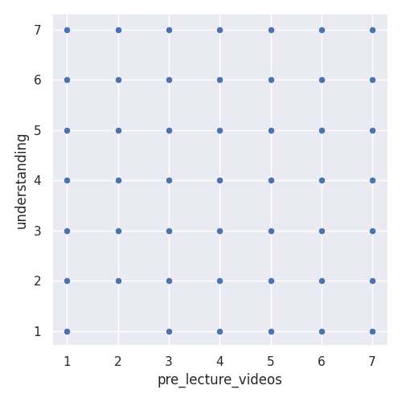
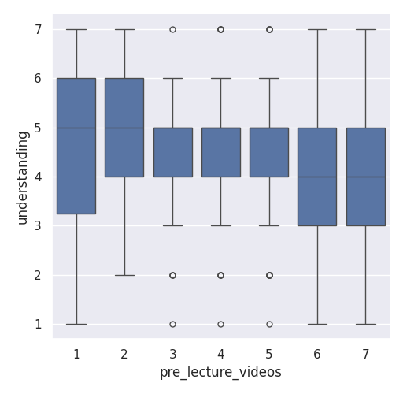
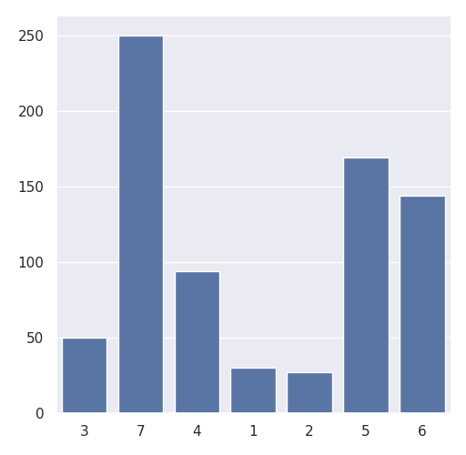

---
# Do not edit the text between these lines!
layout: default
---

# Analysis for Continuous Improvement (EX 09)

## Summary of the analysis

My project is aimed to analyse survey data from COMP110 to explore if pre-lecture videos are associated with higher student understanding. I combined multiple datasets, selected relevant columns, and converted the data into a format suitable for analysis.

Using Python and seaborn, I created several visualizations. First is a scatterplot that shows the relationship between pre-lecture video ratings and understanding. The scatterplot shows no clear linear relationship, as data points are widely distributed across all values.

Second, is a boxplot that compares distributions of understanding across different ratings. The boxplot shows that median understanding remains relatively similar across all ratings of pre-lecture videos, with significant overlap between groups. This suggests that students who rate pre-lecture videos highly don't consistently report higher levels of understanding, indicating that pre-lecture videos may not be a primary factor influencing student comprehension.

And a bar chart to show how students rated the usefulness of pre-lecture videos on a scale from 1 to 7. The distribution is not uniform. The most common rating appears to be 7, indicating that many students strongly agree that pre-lecture videos would be helpful. Ratings of 5 and 6 are also relatively high, suggesting that a majority of students view pre-lecture videos positively.

Lower ratings such as 1 and 2 are less frequent, meaning relatively few students believe that pre-lecture videos would not be helpful.

Also, I added a helper function to filter the dataset and focus on students who rated pre-lecture videos highly, allowing for a more targeted analysis.

## Conclusion of the analysis

This project explores how pre-lecture videos might improve student understanding in COMP110 using survey data collected from students. The goal of the analysis is to evaluate whether students who believe pre-lecture videos are helpful also report higher levels of understanding in the course.

To investigate this, I combined and processed survey datasets, selected relevant variables, and created multiple visualizations using Python and the seaborn library. These included a scatterplot, a boxplot, and a bar chart to examine patterns in student responses.

The results suggest that while many students view pre-lecture videos positively, the relationship between these videos and understanding is not strongly consistent across all students. This indicates that pre-lecture videos may benefit some learners, but are not the only factor influencing success in the course.